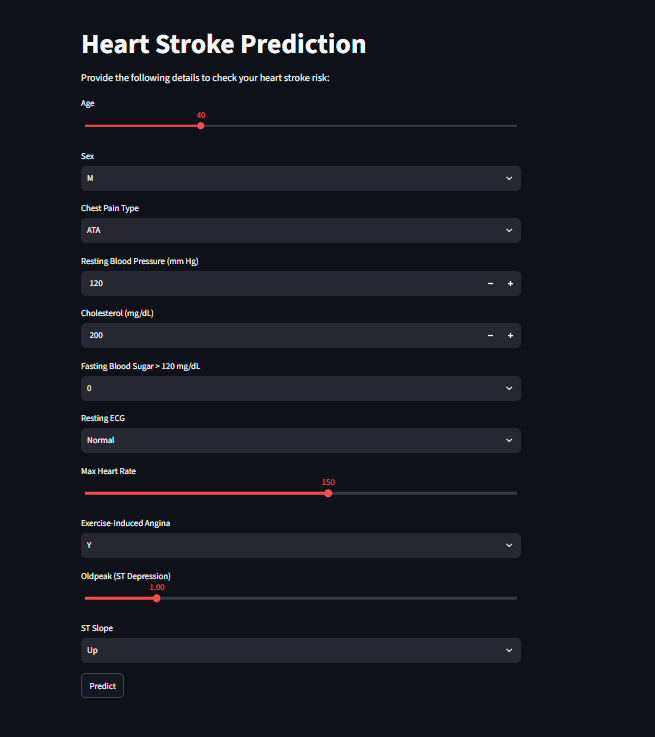

# ❤️ Heart Disease Risk Prediction

A Machine Learning project that predicts the risk of heart disease based on various health and clinical parameters.

The project compares multiple Machine Learning algorithms and uses **K-Nearest Neighbors (KNN)** as the final prediction model because it achieved the best performance among the evaluated models.

The trained model is integrated with a **Streamlit web application** that allows users to enter patient information and get a heart disease risk prediction.

---

## 🚀 Live Demo

Try the deployed Streamlit application:

👉 **[Heart Disease Risk Prediction – Live App](https://connectwithaadi-heart-disease-risk-prediction.streamlit.app/)**

### 🖥️ Application Preview



The web application allows users to enter parameters such as:

- Age
- Sex
- Chest Pain Type
- Resting Blood Pressure
- Cholesterol
- Fasting Blood Sugar
- Resting ECG
- Maximum Heart Rate
- Exercise-Induced Angina
- Oldpeak
- ST Slope

After entering the required details, the application predicts whether the user has a **Low Risk** or **High Risk** of heart disease based on the trained Machine Learning model.

---

## 📌 Project Overview

Heart disease is one of the major health concerns worldwide. Machine Learning can be used to analyze medical data and identify patterns that may help in predicting the risk of heart disease.

In this project, different classification algorithms were trained and evaluated on a heart disease dataset.

The models evaluated were:

- Logistic Regression
- Naive Bayes
- Decision Tree
- Support Vector Machine (SVM)
- K-Nearest Neighbors (KNN)

Among these models, **KNN achieved the highest accuracy and F1-score**, so it was selected as the final prediction model.

---

## 📊 Dataset

The dataset contains **918 records and 12 columns**.

### Features

| Feature | Description |
|---|---|
| Age | Age of the patient |
| Sex | Gender of the patient |
| ChestPainType | Type of chest pain |
| RestingBP | Resting blood pressure |
| Cholesterol | Cholesterol level |
| FastingBS | Fasting blood sugar |
| RestingECG | Resting electrocardiogram result |
| MaxHR | Maximum heart rate achieved |
| ExerciseAngina | Exercise-induced angina |
| Oldpeak | ST depression |
| ST_Slope | Slope of the ST segment |
| HeartDisease | Target variable |

The `HeartDisease` column is the target variable used for classification.

---

## 🔄 Machine Learning Workflow

The project follows the following workflow:

```text
Dataset
   ↓
Data Exploration
   ↓
Data Preprocessing
   ↓
Feature Encoding
   ↓
Train-Test Split
   ↓
Feature Scaling
   ↓
Model Training
   ↓
Model Evaluation
   ↓
Best Model Selection
   ↓
Model Serialization
   ↓
Streamlit Deployment
```

### 🤖 Models Evaluated
The following classification algorithms were trained and evaluated:

| Model | Accuracy | F1 Score |
|---|---|---|
| Logistic Regression | 85.87% | 87.38% |
| Naive Bayes | 84.78% | 86.14% |
| Decision Tree | 77.72% | 79.80% |
| SVM | 84.24% | 86.26% |
| KNN | 86.41% | 88.04% |

### 🏆 Best Model
K-Nearest Neighbors (KNN) achieved the highest performance:

- Accuracy: 86.41%
- F1 Score: 88.04%

Therefore, KNN was selected as the final model for the Streamlit application.

### 🧠 Machine Learning Model
The final prediction pipeline uses:

```text
Input Data
    ↓
Feature Transformation
    ↓
StandardScaler
    ↓
K-Nearest Neighbors
    ↓
Prediction
    ↓
Low Risk / High Risk
```

The trained model, scaler, and feature columns are saved using joblib.

### 💾 Saved Model Files
The project uses the following serialized files:
- `KNN_heart.pkl`
- `scaler.pkl`
- `columns.pkl`

| File | Purpose |
|---|---|
| KNN_heart.pkl | Trained KNN model |
| scaler.pkl | Feature scaling object |
| columns.pkl | Expected feature columns |

These files are loaded by the Streamlit application during startup.

---

## 🖥️ Streamlit Application
The frontend of the project is developed using Streamlit.
The application provides interactive input fields for all required patient parameters.

### Prediction Example
After entering the patient information and clicking the Predict button, the application displays:

> ✅ Low Risk of Heart Disease

or

> ⚠️ High Risk of Heart Disease

---

## 🛠️ Technologies Used

**Programming Language**
- Python

**Machine Learning**
- Scikit-learn
- K-Nearest Neighbors
- Logistic Regression
- Naive Bayes
- Decision Tree
- Support Vector Machine
- StandardScaler

**Data Processing**
- Pandas
- NumPy

**Visualization**
- Matplotlib
- Seaborn

**Model Serialization**
- Joblib

**Web Application**
- Streamlit

**Development Environment**
- Google Colab
- VS Code

**Deployment**
- Streamlit Community Cloud

---

## 📂 Project Structure

```text
heart-disease-risk-prediction/
│
├── app.py
│
├── P2_heart.ipynb
│
├── KNN_heart.pkl
├── scaler.pkl
├── columns.pkl
│
├── requirements.txt
├── README.md
│
├── assets/
│   └── heart-disease-app.png
│
└── .gitignore
```

---

## ⚙️ Installation

Clone the repository:
```bash
git clone https://github.com/connectwithaadi/Heart-Disease-Risk-Prediction
```

Navigate to the project directory:
```bash
cd heart-disease-risk-prediction
```

Create a virtual environment:
```bash
python -m venv .venv
```

Activate the virtual environment on Windows:
```bash
.venv\Scripts\activate
```

Install the required dependencies:
```bash
pip install -r requirements.txt
```

---

## ▶️ Run the Streamlit Application

Run the following command:
```bash
streamlit run app.py
```

The application will open in your browser. Usually, Streamlit runs locally at:
`http://localhost:8501`

---

## 📦 Requirements

The project requires the following Python libraries:
- streamlit
- pandas
- numpy
- scikit-learn
- joblib
- matplotlib
- seaborn

---

## 🔬 Model Training

The complete Machine Learning workflow is available in:
`P2_heart.ipynb`

The notebook contains:
- Dataset loading
- Data exploration
- Data preprocessing
- Feature encoding
- Train-test splitting
- Feature scaling
- Model training
- Model comparison
- Performance evaluation
- Model saving

### 📈 Train-Test Split
The dataset was divided into training and testing sets using:
```python
train_test_split(
    X,
    y,
    test_size=0.20,
    random_state=42
)
```

The features were standardized using:
```python
StandardScaler()
```

---

## 🌐 Deployment

The Streamlit application is deployed using Streamlit Community Cloud.

**Live Application**
👉 [Open Heart Disease Risk Prediction App](https://connectwithaadi-heart-disease-risk-prediction.streamlit.app/)

---

## 🎯 Project Objectives

The main objectives of this project are:
- To explore a heart disease dataset.
- To preprocess clinical data for Machine Learning.
- To compare different classification algorithms.
- To identify the best-performing model.
- To save the trained model for future predictions.
- To build an interactive Streamlit application.
- To deploy the Machine Learning model as a web application.

---

## 🔮 Future Improvements

Some possible improvements for the project include:
- Adding more Machine Learning models.
- Hyperparameter tuning for better performance.
- Adding confusion matrix and ROC-AUC visualization.
- Improving the UI/UX of the Streamlit application.
- Adding probability/confidence scores.
- Adding more comprehensive data validation.
- Deploying the application with a more advanced backend architecture.

---

## ⚠️ Disclaimer

This project is created for educational and demonstration purposes only. The prediction generated by this application should not be considered a medical diagnosis or professional medical advice. Always consult a qualified healthcare professional for medical evaluation and diagnosis.

---

**👨‍💻 Author**

Aditya Kumar Singh
